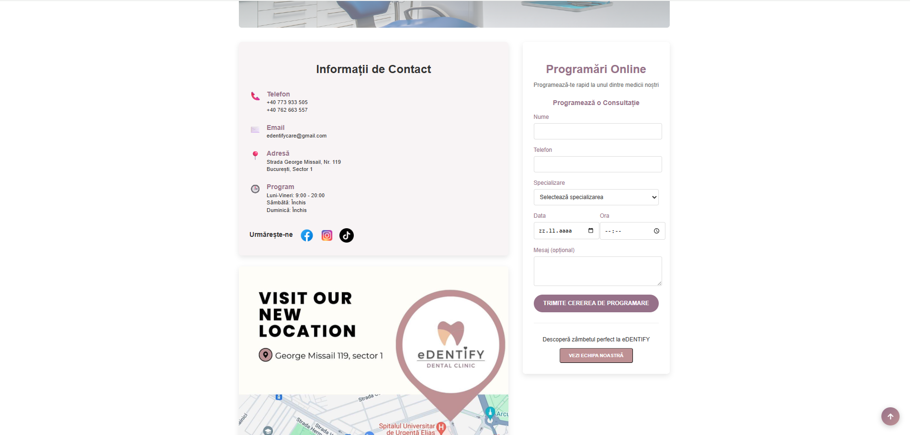
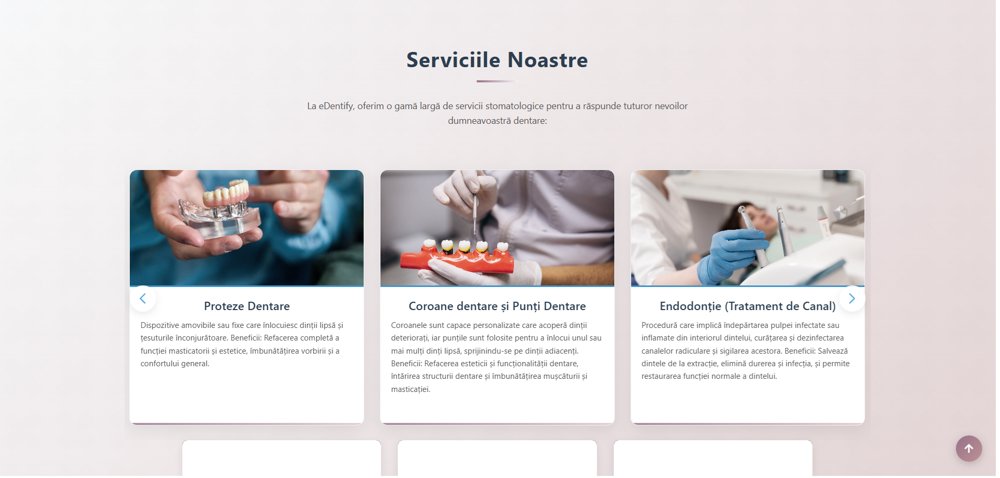

# eDentify – Dental Clinic Website


## Live Demo
[Click aici pentru demo live](https://your-live-demo-link.vercel.app)

---

## Descriere
eDentify este o aplicație web pentru clinicile dentare, creată pentru a oferi utilizatorilor o experiență intuitivă și completă:
- Vizualizare servicii și tarife
- Galerie foto cu proceduri și echipamente
- Formular de programare rapidă
- Design responsive și interactiv

Acest proiect este realizat integral de mine și este construit cu React, având integrare pentru formularul de programare prin EmailJS.

---

## Features
- Pagina principală cu informații despre clinică
- Secțiune servicii și prețuri
- Galerie foto cu efect de slideshow
- Formular de programare funcțional (EmailJS)
- Navigare între secțiuni cu React Router
- Design responsive, compatibil cu mobil și desktop
- Scroll smooth și efecte UI prietenoase

---

## Tech Stack
- **Frontend:** React, React Router, CSS, SwiperJS, React Icons
- **Email:** EmailJS pentru trimitere formulare
- **Deployment:** Vercel

---

## Screenshots / Demo GIF





---

## Roadmap / Planuri viitoare

- Integrare backend real pentru stocarea programărilor (Firebase / Node.js + MongoDB)

- Autentificare utilizatori pentru programări personalizate

- Pagină Contact cu Google Maps și detalii clinică

- Optimizare SEO și performanță (lazy loading imagini, meta tags)

- Adăugarea notificărilor email pentru programări

---

## Installation / Setup

1. Clonează repository-ul:

```bash
git clone https://github.com/andreeaagai/Dental-App.git

---

## Contact

- Email: agapiandreea53@gmail.com
- LinkedIn: https://www.linkedin.com/in/andreea-agapi-015705216/
- GitHub: andreeaagai
